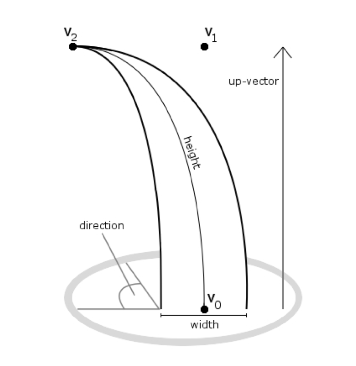

Vulkan Grass Rendering
==================================

**University of Pennsylvania, CIS 5650: GPU Programming and Architecture, Project 4**

- Wang Ruipeng
    - [LinkedIn](https://www.linkedin.com/in/ruipeng-wang-681b89287/)
    - [Personal Website](https://wang-ruipeng.github.io/)
- Tested on: Windows 10, i7-10750H CPU @ 2.60GHz 16GB, RTX 2070 Max-Q 8GB

# Live Demo

# Control

- Left click and move to change the camera position.
- Right click and move to move the collision object.
- Scroll up and down to move closer or further.
- Click and scroll the mouse wheel to change the size of the collision object.

# Description

This project is an implementation of the paper: [Responsive Real-Time Grass Rendering for General 3D Scenes](https://www.cg.tuwien.ac.at/research/publications/2017/JAHRMANN-2017-RRTG/JAHRMANN-2017-RRTG-draft.pdf).

## **Representing Grass as Bezier Curves**

### 1. **Bezier Control Points:**

Each grass blade is represented by a cubic Bezier curve with three control points:

- `v0`: The base of the grass blade, which is positioned on the underlying geometry. This control point is anchored at the surface where the grass grows.
- `v1`: The midpoint control point, which guides the shape of the Bezier curve. It is always placed "above" `v0` relative to the grass blade's "up" vector, maintaining the natural curvature of the blade.
- `v2`: The tip control point, which is influenced by environmental forces. This point undergoes the most deformation during the simulation and gives the grass its animated, dynamic appearance.

### 2. **Per-Blade Characteristics:**

For each grass blade, additional characteristics are stored to assist in the simulation and rendering:

- **Up vector (`up`)**: This is the blade's local up direction, corresponding to the surface normal at the base point `v0`. It ensures the blade grows upward relative to the surface geometry.
- **Direction**: The direction in which the grass blade is facing. It affects the visual orientation of the grass when viewed from different angles.
- **Height**: The total height of the grass blade, controlling how long the Bezier curve is.
- **Width**: The width of the grass blade, which will be applied when rendering.
- **Stiffness Coefficient**: This determines how stiff or flexible the grass blade is when simulating external forces. A higher stiffness makes the blade resist bending, while lower stiffness allows more flexibility.

These properties are packed into four `vec4` variables, where the `.w` component of each vector stores additional information:

- `v0.w` holds the blade's orientation.
- `v1.w` holds the blade's height.
- `v2.w` holds the blade's width.
- `up.w` holds the stiffness coefficient.

### 3. **Bezier Curve Representation:**

During the simulation, the control points `v0`, `v1`, and `v2` define the curve of the grass blade. The midpoint (`v1`) is used to maintain the blade's natural curvature, while `v2` is updated by simulating forces (such as gravity and wind). The blade's shape is then tessellated into geometry for rendering in the graphics pipeline.

## **Simulating Forces**

### 1. **Gravity:**

- Gravity pulls the grass blades downward. We can calculate the total gravity force in the environment using a gravity direction vector `D.xyz` and a magnitude `D.w`. The total gravity force is computed as:
    - `gE = normalize(D.xyz) * D.w` (environmental gravity).
    - A **front gravity** component (`gF`) was also calculated based on the blade’s facing direction (`f`) to add more natural motion.
    - The final gravity force is the sum: `g = gE + gF`.

### 2. **Recovery Force (Hooke’s Law):**

- A recovery force was implemented to bring each grass blade back to its equilibrium position after being displaced by forces like gravity or wind. This force was calculated based on Hooke’s law:
    - Compare the current position of the blade tip `v2` to its initial position `iv2` (before any simulation).
    - The recovery force was computed as: `r = (iv2 - v2) * stiffness`, where `stiffness` controls how rigid or flexible the grass blade is.

### 3. **Wind:**

- Wind was simulated by creating a wind function based on time and position (`v0`). The wind direction affects how the grass blades move, with stronger effects on blades aligned with the wind.
- The wind alignment factor was used to determine how much the wind affects a given blade. The total wind force (`w`) is calculated as:
    - `windForce = windDirection * windAlignment`.
    
    
    

### 4. **Total Force:**

- After calculating the individual forces (gravity, recovery, and wind), the total force acting on the tip of each grass blade (`v2`) was calculated:
    - `tv2 = (gravity + recovery + wind) * deltaTime`.
- This translation force is then applied to `v2`, updating its position over time.

### 5. **Force Correction:**

- To ensure realism, corrections were applied to the grass blade:
    - Ensure `v2` does not move below ground or break the blade's natural length.
    - Adjust `v1` (the midpoint control point) so the grass blade maintains the correct curvature and length as defined by the blade's height.

## **Culling Tests**

### 1. **Orientation Culling:**

- Grass blades facing away from or perpendicular to the camera’s view were culled to prevent rendering blades that are barely visible or too small to impact the frame.
- This was achieved by performing a dot product test between the grass blade’s front-facing direction and the camera’s view vector.
- If the result indicated that the blade was nearly perpendicular to the view direction (with a dot product threshold, e.g., 0.9), the blade was culled to avoid rendering thin, nearly invisible blades, reducing aliasing artifacts.

### 2. **View-Frustum Culling:**

- Grass blades entirely outside the camera’s view-frustum were culled to avoid rendering blades that would not be visible.
- For each blade, three points (`v0`, `v2`, and `m`, where `m` is a midpoint approximation) were tested to determine if they were inside the view-frustum.
- If all three points were outside the frustum, the grass blade was culled. A tolerance value was used to make the culling more conservative, ensuring that blades near the edge of the frustum weren’t mistakenly culled.

### 3. **Distance Culling:**

- Grass blades far away from the camera were culled to prevent rendering blades that appear too small to be visible or meaningful at a distance.
- A maximum distance parameter was defined, beyond which all grass blades were culled.
- Grass blades within the viewable distance were grouped into several buckets based on their distance from the camera. As the distance increased, more blades within each bucket were culled progressively, preserving more detail for closer blades while reducing the number of distant blades rendered.

## Extra Credit

### Dynamic Tessellation

In the implementation, I tessellated the grass to varying levels of detail as a function of how far the grass blade is from the camera. The performance is increased, the detailed performance is attached below.

|  | Dynamic Tessellation | No Dynamic Tessellation |
| --- | --- | --- |
| Frame Generation Time (ms) | 10.527 | 12.64 |

*Tested within 2^19 grass blade.*

### Collision

I also implemented the collision mentioned in the paper.

You can control the size and position of the collision impact. The logic is to detect collisions between grass blades and a sphere. If either the blade's tip (`v2`) or its midpoint is inside the sphere, the blade is pushed out to the surface of the sphere.

The total grass forces look like this:

